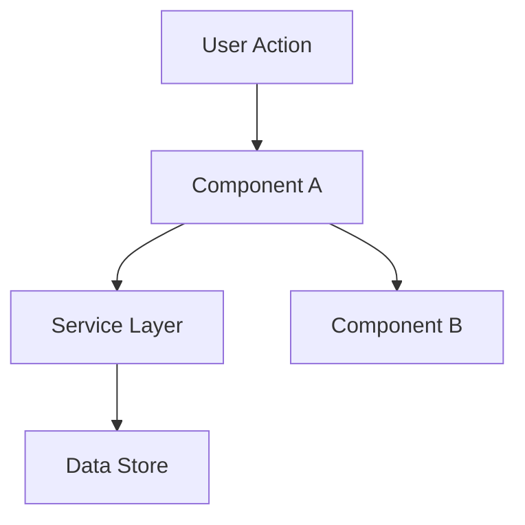

# Design

**Goal**: Define HOW to build it. Architecture, components, what to reuse.

**Skip this phase when:** The change is straightforward — no architectural decisions, no new patterns, no component interactions to plan. For simple features, design happens inline during Execute.

## Process

### 1. Load Context

Read `.specs/features/[feature]/spec.md` before designing. If `.specs/features/[feature]/context.md` exists, load it too — it contains implementation decisions that constrain the design (layout choices, behavior preferences, interaction patterns). Decisions marked as "Agent's Discretion" are yours to decide.

**Mandatory: read `.specs/STATE.md` `## Decisions` now.** This MUST happen before any architectural choices are made. Every `active` `AD-NNN` entry is a project-level constraint this design must conform to. If a decision from a prior feature conflicts with what is best for this feature, you have two options — both require an explicit choice:

1. **Conform** — Design within the active constraint.
2. **Supersede** — Append a new `AD-NNN` entry to `.specs/STATE.md` `## Decisions` that supersedes the old one (set the old entry's `status` to `superseded by AD-NNN`) and document the reason. The new decision becomes the project standard going forward.

Silently ignoring an active decision is not an option — it creates invisible inconsistency across features.

**Also load confirmed lessons** relevant to this feature: `python3 scripts/lessons.py list --status confirmed` (filter with `--scope`/`--query`). These are past verification failures distilled into guidance — apply them while designing. Load only `confirmed`. Skip silently if no store or no code tool. See [lessons.md](lessons.md).

### 1.5. Research (Optional but Recommended)

If the feature involves unfamiliar technology, patterns, or integrations, research before designing. Document findings briefly in the design doc or as inline notes. This prevents incorrect assumptions from propagating into tasks.

Follow the **Knowledge Verification Chain** (see SKILL.md) in strict order:

```
Codebase → Project docs → Context7 MCP → Web search → Flag as uncertain
```

**CRITICAL: NEVER assume or fabricate information.** If you cannot find an answer through the chain, explicitly say "I don't know" or "I couldn't find documentation for this". Inventing an API, a pattern, or a behavior that doesn't exist is far worse than admitting uncertainty. Wrong assumptions propagate through design → tasks → implementation and cause cascading failures.

Good triggers for research: new libraries, unfamiliar APIs, performance-sensitive features, security-sensitive features, patterns you haven't used in this codebase before.

**Concern flagging (MUST do while reading code):** While walking the codebase via the Knowledge Verification Chain, flag any concerns you encounter in the areas this feature touches. Capture each finding in the `## Risks & Concerns` section of `design.md`:

- **Fragile code** — tight coupling, large functions, implicit state
- **Tech debt** — hacks, workarounds, deprecated APIs
- **Security risks** — unvalidated input, auth gaps, exposed secrets
- **Performance bottlenecks** — N+1 queries, unbounded loops, missing indexes
- **Test coverage gaps** — untested paths the feature depends on

Every flagged concern MUST include a mitigation — how the design (or a follow-up task) addresses it.

### 2. Define Architecture

**Large/Complex only — approach exploration:** Before committing to a single architecture, present 2–3 viable approaches with trade-offs and a recommendation. Lead with the recommendation to avoid analysis paralysis. All approaches must deliver the same scoped thing (no alternative scopes). Confirm the chosen approach with the user before detailing components. Medium features: skip — design inline.

Overview of how components interact. Use mermaid diagrams when helpful.

### 3. Identify Code Reuse

**CRITICAL**: What existing code can we leverage? This saves tokens and reduces errors.

Flag any concerns found here per step 1.5 into `## Risks & Concerns`.

### 4. Define Components and Interfaces

Each component: Purpose, Location, Interfaces, Dependencies, What it reuses.

### 5. Define Data Models

If the feature involves data, define models before implementation.

---

## Template: `.specs/features/[feature]/design.md`

````markdown
# [Feature] Design

**Spec**: `.specs/features/[feature]/spec.md`
**Status**: Draft | Approved

---

## Architecture Overview

[Brief description of the architecture approach]


````

---

## Code Reuse Analysis

### Existing Components to Leverage

| Component            | Location            | How to Use                |
| -------------------- | ------------------- | ------------------------- |
| [Existing Component] | `src/path/to/file`  | [Extend/Import/Reference] |
| [Existing Utility]   | `src/utils/file`    | [How it helps]            |
| [Existing Pattern]   | `src/patterns/file` | [Apply same pattern]      |

### Integration Points

| System         | Integration Method                      |
| -------------- | --------------------------------------- |
| [Existing API] | [How new feature connects]              |
| [Database]     | [How data connects to existing schemas] |

---

## Components

### [Component Name]

- **Purpose**: [What this component does - one sentence]
- **Location**: `src/path/to/component/`
- **Interfaces**:
  - `methodName(param: Type): ReturnType` - [description]
  - `methodName(param: Type): ReturnType` - [description]
- **Dependencies**: [What it needs to function]
- **Reuses**: [Existing code this builds upon]

### [Component Name]

- **Purpose**: [What this component does]
- **Location**: `src/path/to/component/`
- **Interfaces**:
  - `methodName(param: Type): ReturnType`
- **Dependencies**: [Dependencies]
- **Reuses**: [Existing code]

---

## Data Models (if applicable)

### [Model Name]

```typescript
interface ModelName {
  id: string
  field1: string
  field2: number
  createdAt: Date
}
```

**Relationships**: [How this relates to other models]

### [Model Name]

```typescript
interface AnotherModel {
  id: string
  // ...
}
```

---

## Error Handling Strategy

| Error Scenario | Handling      | User Impact      |
| -------------- | ------------- | ---------------- |
| [Scenario 1]   | [How handled] | [What user sees] |
| [Scenario 2]   | [How handled] | [What user sees] |

---

## Risks & Concerns

| Concern | Location (file:line) | Impact | Mitigation |
| ------- | -------------------- | ------ | ---------- |
| [Fragile code / tech debt / security / perf / test gap] | `src/path/file.ts:42` | [What breaks or degrades] | [How the design or a follow-up task addresses it] |

> None found — is a valid entry.

---

## Tech Decisions (only non-obvious ones)

| Decision          | Choice          | Rationale     |
| ----------------- | --------------- | ------------- |
| [What we decided] | [What we chose] | [Why - brief] |

> **Project-level decisions:** If a decision here sets a convention, pattern, or constraint that future features must follow, append it to `.specs/STATE.md` `## Decisions` as the next `AD-NNN` entry (see [memory.md](memory.md)). Feature-local decisions stay only in this table.

---

## Tips

- **Load context first** — If context.md exists, decisions there are locked
- **Research when uncertain** — 5 minutes of research prevents hours of rework
- **Reuse is king** — Every component should reference existing patterns
- **Interfaces first** — Define contracts before implementation
- **Keep it visual** — Diagrams save 1000 words
- **Small components** — If component does 3+ things, split it
- **Flag concerns inline** — Risks found during research go in Risks & Concerns with a mitigation
- **Confirm before Tasks** — User approves design before breaking into tasks
